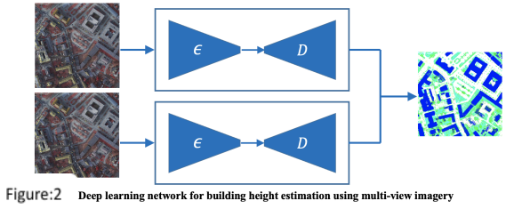

# Building Height Estimation 

The objective of this assignment is to introduce you to the concept of autoencoders and
their use in building height estimation. The task involves utilizing single view and multi view
Google Earth Imagery to identify the height of buildings in 42 Chinese cities, comprising 4
municipalities, 26 provincial capitals, and 12 large cities. The focus is on urban areas of these
cities, which offer diverse buildings with varying colors, shapes, sizes, and height.

A dataset of 4394 training samples is provided, already split into 70%, 10%, and 20% for
train, validation, and test sets. The assignment requires you to create an autoencoder for
building height estimation, a regression task where appropriate losses must be utilized. The
goal is to achieve the lowest possible Root Mean Square Error (RMSE) in your model

Reference paper link: [Paper Link](https://www.sciencedirect.com/science/article/abs/pii/S0034425721003102)

## Building Height Estimation Via Deep Learning Network

Building height can be estimated using end-to-end deep learning network as shown
in Fig-1

a. Use a single view image for building height estimation with an autoencoder

b. Utilize both view images for building height estimation using either a symmetrical pair of encoders and one decoder or two encoders and two decoders.

c. Combine building segmentation estimation with height estimation to enhance the
model's performance. Repeat steps a) and b) and report the effect on RMSE. 