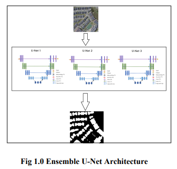
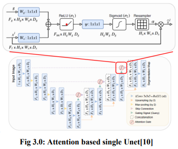
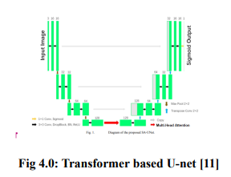

# Enhancing House Boundary Prediction from Aerial Imagery: A Hybrid Approach with Ensemble U-Net and Transformer Attention

## Introduction:

Deep learning algorithms for analyzing satellite
photos and estimating house borders have gained
prominence in recent years. However, this is a
challenging task that requires the integration of
many data sources, feature extraction, and advanced
modeling approaches. The purpose of this State of
the Art (SOA) model is to study the most recent
research on house border prediction using satellite
photos in order to select and implement the most
promising strategies.
The use of satellite images has transformed the field
of geospatial analysis, allowing the development of
a diverse set of applications that can provide useful
insights into the earth's surface. One such use is the
prediction of home borders using satellite photos.
This is a significant issue to answer since exact
house boundary information is necessary for a
variety of applications ranging from property
assessment to urban planning.

## Dataset:

For this project, we utilized the WHU Building
dataset which was provided by The Group of
Photogrammetry and Computer Vision (GPCV) at
Wuhan University. This dataset comprises over
8,000 images, each with a resolution of 512x512
pixels, as well as the corresponding hot-encoded
segmentation mask for houses. To increase the size
and diversity of the dataset, we augmented it with
rotations, flips, and crops, resulting in a total of
11,000 images. This augmentation process aimed to
prevent overfitting and enhance the robustness and
generalizability of the model. The WHU Building
dataset is widely used for predicting house
boundaries and includes high-resolution satellite
images of residential areas from various regions of
the world.

Dataset link: [WHU Building Dataset](https://www.kaggle.com/datasets/xiaoqian970429/whu-building-dataset)

## Loss Function

In this project, we utilized the root mean squared
error (RMSE) as the loss function for our model.
RMSE is a commonly used regression loss function
that calculates the square root of the average of the
squared differences between the predicted values
and the actual values. By using RMSE, we aim to
minimize the difference between the predicted and
ground truth segmentation masks for houses in
satellite images.
The RMSE loss function is well-suited for our
project since it penalizes larger errors more than
smaller ones. Additionally, it provides a good
measure of the overall performance of the model by
considering both the magnitude and direction of the
errors. By minimizing the RMSE loss during
training, we can ensure that our model accurately
segments houses in satellite images and generalizes
well to new, unseen data.

## Approaches

### 1. Ensemble U-Net

Initially, we developed an ensemble approach that
consists of U-Net models (Fig 1.0). The ensemble
model is implemented by integrating 3 U-Net
models in order to improve its accuracy. The model
takes the satellite image as input and outputs the
segmented image of the detected objects. This is
done by passing input images through 3 separate
identical U-net models and each model generates its
outputs depending on its extracted features then
output from all 3 U-net models is aggregated in
order to get the final output. The results produced
by it can be seen in the result section.

### 2. Ensemble Attention U-Net

Our second approach involved an ensemble model
consisting of U-Net models with attention
mechanisms. This approach aimed to enhance the
model's performance by integrating multiple U-Net
models and leveraging their extracted features.
The ensemble model takes satellite images as input
and uses three separate attention-based U-Net
models to generate outputs. Each U-Net model
focuses on different aspects of the image and
generates its own output. The outputs from all the
U-Net models are then combined or aggregated to
produce the final segmentation mask.

Our experimental results demonstrate that this
ensemble approach significantly improves the
accuracy of object segmentation compared to a
single U-Net model. The attention mechanisms used
in the U-Net models enable the model to focus on
relevant features in the input image and make more
accurate predictions. The final outputs produced by
the ensemble model are shown in the result section
of our research paper.

### 3. Ensemble Transformer U-Net

In our research, we experimented with three
different variations of the model to improve the
accuracy of house segmentation in satellite images.
The third and final model we developed is a
combination of U-Net models and Transformer
layers, which we integrated into an ensemble
model. Each of the three identical U-Net models
includes a Transformer layer and a Multihead
Attention layer in the bottleneck between the U-Net
encoder and decoder to enhance feature extraction
and capture long-range dependencies. The model
takes satellite images as input, which are then
decoded by the U-Net decoder and passed through
the Multihead Attention layer. Finally, the model
outputs a segmentation mask that accurately
identifies the location of houses in the images. Our
experimental results show that this ensemble model
outperforms the other two variations, demonstrating
the effectiveness of incorporating Transformer
layers and multi-model ensembles in satellite image
segmentation tasks. We believe that this model has
the potential for real-world application in various
fields such as urban planning, disaster management,
and resource allocation.

## Conclusion

To summarize, the issue of detecting home
boundaries via segmentation is a difficult challenge
in computer vision. We compared multiple distinct
models for this job in this study: U-Net, Ensemble
U-Net, Ensemble attention U-Net and Ensemble
Transformer U-Net. In terms of accuracy and
efficiency, our results show that the Ensemble
Transformer U-Net surpasses the other models. The
suggested model combines the strengths of the
U-Net and Transformer architectures to improve
segmentation outcomes. As a result, we can infer
that the Ensemble Transformer U-Net is the best
model for detecting house boundaries using
segmentation, and it has the potential to be used in
other segmentation tasks in the future.
