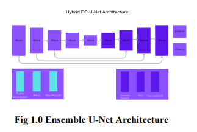
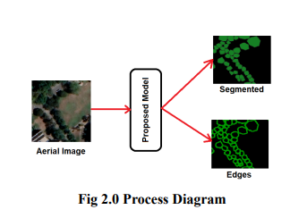

# Optimizing Tree Counting Prediction from Aerial Imagery: A Hybrid Approach using Do-U-Net and Fuzzy Logic

## Introduction 

Identifying and counting trees is an important task
in agriculture and ecological research. Efficient and
accurate tree identification and counting provide
important information for understanding forest
structure, biodiversity, and ecosystem functioning.
However, current techniques for counting, such as
manual measurements and visual surveys are
time-consuming, labor-intensive and prone to error.
Technology advancements, such as hybrid models
provide new opportunities for improving tree
identification and counting. These technologies
enable the collection, preprocessing, modeling and
analysis of massive amounts of data which can be
used to develop more precise and efficient methods
for identifying and counting tree species than
traditional techniques.
In order to advance in this task, hybrid systems
which integrate methods like fuzzy logic, neural
networks, and evolutionary algorithms have shown
to be a viable approach. To increase the precision
and effectiveness of this task, these systems
aggregate and process data from several sources,
such as satellite photos and ground-based
measurements. There aren't many systematic
reviews of the literature, despite an increase in
study into the application of hybrid systems for this
purpose. So we analyzed and developed hybrid
mode for this purpose.

## Datasets

The quality of the dataset is very important for this
task of tree identification. The noise in the dataset
and the quality of segmentation can greatly affect
the performance of the model. For this project the
areas of Lums university Lahore, Pakistan were
chosen and two images of other areas were added
for this task. The images of Lums university,
Image1 and Image2 areas are of size 3137 x 2160
pixels, 1618 x 897 pixels and 1364 * 1797 pixels
respectively. The images are converted into usable
format by cropping xyz tiles with the zoom level of
19 and 21 combined. The zoom level 19 crops the
image into 0.2986 meters/pixels and zoom level 21
crops the image into 0.074646 meters/pixels. The
images produced are of size 200x200 pixels for the
deep learning models. To get variations in the data.
The data is further increased with augmentations
like random rotations, flips and scaling. The image.
The segmentation of trees are annotated manually
using the specialized and open source tool QGIS.
QGIS is a geographic information system that
allows users to create, edit, and visualize spatial
data. The manual annotations of the trees required a
very careful attention to detail and accuracy. The
annotators had to draw polygons around each tree
and segment them according to their canopy and
attributes. The annotations are cropped similarly as
the images to maintain the order and mapping of the
image patches. This means that each image patch
has a corresponding annotation file that contains the
segmentations of the trees in that patch. This way,
the segmentation model can learn from both the
image and the annotation data

## Loss Function

In this project, we utilized the root mean squared
error (RMSE) as the loss function for our model.
RMSE is a commonly used regression loss function
that calculates the square root of the average of the
squared differences between the predicted values
and the actual values. By using RMSE, we aim to
minimize the difference between the predicted and
ground truth segmentation masks for trees in
satellite images.
The RMSE loss function is well-suited for our
project since it penalizes larger errors more than
smaller ones. Additionally, it provides a good
measure of the overall performance of the model by
considering both the magnitude and direction of the
errors. By minimizing the RMSE loss during
training, we can ensure that our model accurately
segments trees in satellite images and generalizes
well to new, unseen data.

##  APPROACHES

### **Fuzzy Do-U-Net**

For this purpose, we developed a hybrid approach
that consists of two methods: neural network and
fuzzy Pooling. The hybrid model is implemented by
integrating a fuzzy pooling in the neural network in
order to improve its accuracy. For neural networks,
The Duel-Output U-Net (DO-U-Net) model is
selected which is the modified version of U-Net.
The Duel-Output U-Net (DO-U-Net) for
Segmentation and Edge detection is a neural
network architecture that can do two things at once:
segment objects in an image and detect edges for
each object. Here's a high-level overview of how
this model works:

## Conclusion 

To summarize, the issue of detecting trees and tree
boundaries via segmentation is a difficult challenge
in computer vision. We compared multiple distinct
models for this job in this study: U-Net, Fuzzified
U-Net. In terms of accuracy and efficiency, our
results show that the Fuzzified U-Net surpasses the
other models. The suggested model combines the
strengths of the U-Net and Transformer
architectures to improve segmentation outcomes. As
a result, we can infer that the Fuzzified U-Net is the
better model for this task than the simple UNet.
Tree detection and identification using segmentation
has the potential to be used in other segmentation
tasks in the future like tree species identification,
tree counting etc.
