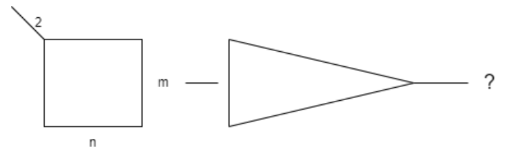
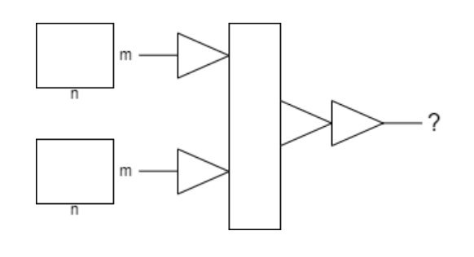
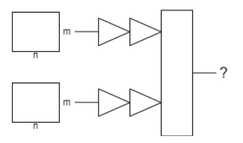

# Introduction

Convolutional Neural Networks (CNNs) have revolutionized the field of computer vision,
enabling machines to see and recognize images and videos with remarkable accuracy. CNNs are
a type of neural network specifically designed for image classification, object detection, and
image segmentation tasks. The key feature of CNNs is their ability to learn hierarchical
representations of visual data by using convolutional and pooling layers to extract features at
different scales. This programming assignment aims to introduce you to the basics of building
and training CNNs in PyTorch, one of the most popular deep learning frameworks. By the end of
this assignment, you will have implemented a number of distinct CNN-based models for the task
of classifying whether a pair of images falls into the category of “Snow” or “Not Snow”.

# Data

Dataset contains two main class folders.
1. Snow
2. Not Snow

Some pointers:

- Each of these folders will contain multiple subfolders, and each of the subfolders willcontain a pair of images.
- Pair of images show two pictures of the same area, taken between a specific interval.
- All images will be in grayscale.
- Since there will be a lot of data going into your model, you will have to utilize PyTorch’s DataLoaders (read through this [link](https://pytorch.org/tutorials/beginner/basics/data_tutorial.html) properly).
- Some of the models will have different formats of data going in, so be prepared to create
instances of different DataLoaders or deal with this on the fly in your training loop.

# Concepts

Some necessary concepts to understand before tackling the assignment:

## 1. Stacked Images

You can send both images stacked on top of each other as your model input (so the stack would
have 2 channels for grayscale images). Then, pass them to a CNN and give a class output.

## 2. Early-merge strategy

You can send both of the images separately to different layers of the network. Perform some
convolution, concatenate or aggregate the outputs of the convolution (in some way), then pass
through more layers and finally give a class output.

As the name suggests, most of your convolution should be placed after the concatenation and
only some of the convolution should be before the concatenation/aggregation.

## 3. Late-merge strategy

Here, your model should accept images as different outputs, perform convolution on both of the images separately, and in the end concatenate them and give a classification output.

## 4. Hard Parameter Sharing/No Parameter Sharing

If there are two inputs going into the model, and they are being processed side-by-side in two distinct branches, this approach involves letting the two branches process the inputs independently of each other. This is a standard/vanilla approach to processing multiple inputs.

## 5. Soft Parameter Sharing

Building on the previous concept, suppose that the two branches or sequences of layers (meant for different inputs) could influence one another. This can be done by connecting them in some fashion, like adding together their activations similar to a ResNet, or just concatenating them
and sending the stack forward.

# Tasks and Comparative Analysis Table

Every research work requires a comparative analysis table in which one compares their own model with other state of the art models to determine if their model actually performs better.

You are required to implement 8 models.

There are 5 models you must implement:
1. Stacked Images Input
2. Late Merge with Hard Parameter Sharing
3. Late Merge with Soft Parameter Sharing
4. Early Merge with Hard Parameter Sharing
5. Early Merge with Soft Parameter Sharing

The last three models are of your choice: note that something simple as adding more layers,
changing the learning rate, or training for more epochs doesn’t count. Try fun ideas like
Adaptive Learning Rates, different forms of Data Augmentation, Label Smoothing, Inference
Resizing etc.

This excel sheet will contain the following columns:
1. Model Name
2. One-line description of the model
3. Number of Parameters
4. Best accuracy achieved on the test set.
